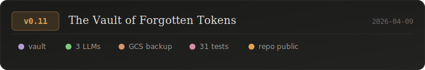
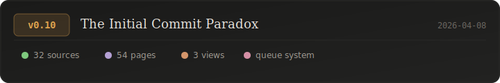

# Changelog

All notable changes to this project will be documented in this file.

---

## [0.11] — 2026-04-09

### The Vault of Forgotten Tokens

The one where the wiki learns to keep secrets, talk to three different LLMs, and back itself up to the cloud — then goes public.

### Added
- **Vault**: Private wiki pages in gitignored `vault/` directory with lock indicators in sidebar/graph and move-to-vault toggle button on every page
- **LLM Chat**: `POST /api/chat` endpoint with wiki context retrieval, supporting Mistral (default), Claude, and Gemini via model selector dropdown
- **GCP Backup**: One-click backup of wiki/vault/raw to Google Cloud Storage (`gs://kuskwiki/backups/{timestamp}/`) with status card and progress polling in Manage view
- **Branch protection**: GitHub ruleset on main requiring PRs, no force push, admin bypass
- **Test suite**: 17 API tests (bun:test) + 14 Playwright UI tests covering all features

### Changed
- Health grid uses responsive auto-fill layout (5 cards)
- Repo visibility changed from private to public
- `node_modules/` and `vault/` added to `.gitignore`

---

## [0.10] — 2026-04-08

### The Initial Commit Paradox

The one where the wiki bootstraps itself from nothing into a fully functional knowledge graph.

### Added
- Wiki server (`server.ts`) with Bun runtime on port 5000
- Web UI with Graph, Page, and Manage views
- Knowledge graph visualization with physics simulation
- Command palette search (`/` or `Cmd+K`)
- Add Source modal (paste, upload, URL)
- Wiki Manager dashboard with health metrics
- Source ingestion status tracking (pending/done)
- Broken wikilink and orphan page detection
- Auto-ingest toggle and action queue system
- Queue/config API endpoints (`.wiki-queue.json`, `.wiki-config.json`)
- Server control script (`wiki.sh`)
- 32 raw sources ingested into 54 wiki pages
- Full cross-referencing with bidirectional wikilinks
